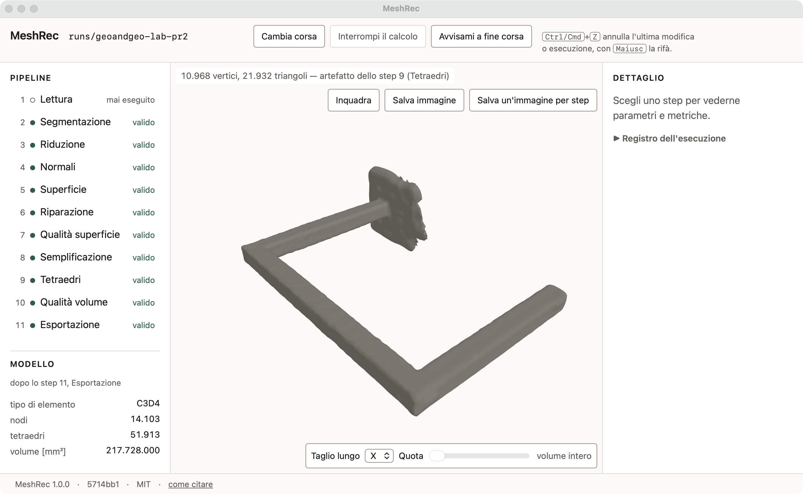

# MeshRec

[](https://github.com/maeurong/meshrec/releases)
[](LICENSE)
[](meshrec/pyproject.toml)
[](https://doi.org/10.5281/zenodo.22728395)

**Dal rilievo fotogrammetrico di una struttura in cemento armato al modello FEM, in modo riproducibile.** Ingressi: `.pcd`, `.ply`, `.xyz`.
Uscite: deck Abaqus `.inp` e geometria `.step`.



Il percorso è di undici passaggi — segmentazione della nuvola di punti,
ricostruzione della superficie, riempimento a tetraedri, esportazione del
modello — e ogni passaggio salva i parametri con cui è stato eseguito e le
misure di qualità del proprio risultato.

Il programma si ferma al deck. L'analisi si esegue in Abaqus, aprendo il file
`.inp` che il programma ha scritto: MeshRec costruisce il modello, non lo
risolve. I risultati ottenuti in questo modo sul caso studio confluiranno in
[`analisi-abaqus/`](analisi-abaqus/), accanto ai deck che li hanno prodotti.

## Dove guardare

- **[`meshrec/`](meshrec/)** — il programma. Requisiti, avvio, configurazioni del
  caso studio e verifiche di fattibilità: [`meshrec/README.md`](meshrec/README.md).
- **[`PRODUCT.md`](PRODUCT.md)** — a chi serve, che cosa deve fare, e i vincoli
  di prodotto che ne discendono.
- **[`docs/`](docs/)** — esiti delle fasi di sviluppo e ricerche di validazione.

## Avvio

Servono Python 3.12 e [uv](https://docs.astral.sh/uv/).

```bash
cd meshrec
uv sync
uv run meshrec serve
```

Si apre in una finestra propria con l'elenco delle corse già eseguite, e la
possibilità di crearne una nuova da un file di punti (`.pcd`, `.ply`, `.xyz`).
Su macOS basta il doppio clic su `meshrec/MeshRec.app` (al primo avvio macOS
chiede di autorizzarlo da Impostazioni di Sistema › Privacy e sicurezza ›
«Apri comunque»); su Windows `meshrec/MeshRec.bat`, e
`meshrec/crea-collegamento.ps1` mette MeshRec nel menu Start con la sua icona.
