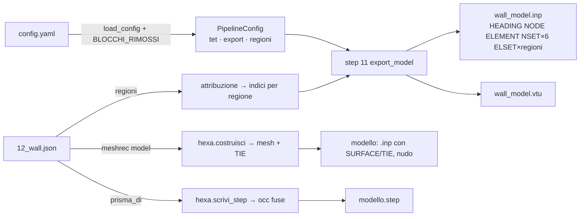

# ADR 2026-09-07 — Deck nudo: via `analysis`, `carichi`, `selettori`, materiale delle regioni

Stato: proposto. Decisione di prodotto già presa con Mario (deck nudo, blocchi
da togliere, STEP dal prior): qui si decide **come** toglierli e dove va ciò che
sopravvive. Repo `meshrec/`, `main` a `cb6ef7e`; ogni riga citata è stata letta
su quel commit.

## Contesto

Il tutor importa il deck in Abaqus/CAE e assegna lui materiale, sezione, passi,
peso proprio, carichi, vincoli. Lo spike (`runs/spike-abaqus/`) mostra che un
deck con soli `*HEADING`/`*NODE`/`*ELEMENT`/`*NSET` si importa, i set sono
selezionabili, il job gira. Il deck attuale porta venti righe in più
(`pilastro_pieno.inp:26070-26089`: sezione, materiale, elastico, densità,
`*BOUNDARY`, passo statico con `*DLOAD` e uscite): righe che in CAE vanno
ignorate o sovrascritte, e che la configurazione obbliga a compilare
(`analisi_dichiarata`, `config.py:1483`) prima di poter scrivere un deck.

Ciò che oggi produce quelle righe:

| cosa | dove | righe |
|---|---|---|
| `AnalysisConfig` (material, gravity, fixed_nset, step_name, set_tolerance_factor) | `config.py:524-574` | 50 |
| carichi: `SpintaOrizzontale`, `CaricoSommita`, `Modale`, `Momento`, `CaricoPosizionato`, `CaricoDistribuito`, `Combinazione`, `CarichiConfig` | `config.py:409-523, 1016-1216` | ~330 |
| selettori: `SelettoreBox/Sfera/Nodo/Nset` + `core/selezione.py` | `config.py:954-1015`, 206 righe modulo | ~270 |
| `MaterialeDichiarato`, `RegioneConfig.materiale`, catalogo `core/materiali.py`, `/api/materiali`, pannello materiale | `config.py:1217-1292, 1316`, 447 righe modulo, `server.py:1410-1458`, `app.js:2850-3160` | ~900 |
| scrittura passi/carichi/materiali nel deck: `_passo_statico`, `_Azione`, `_riga_scalata`, `_materiali_del_deck`, `superficie_di_pressione`, `ripartisci`, `coppia_equivalente`, corpo di `write_inp` | `abaqus.py:85-323, 324-858, 1034-1135, 1263-1528` | ~1100 |
| `ModelConfig.lateral_nset/lateral_pressure` (carico laterale del modello parametrico) | `config.py:904-925`, `pipeline.py:350-353` | 30 |

Restano, perché il tutor li usa: i sei `*NSET` di faccia (`build_node_sets`,
`abaqus.py:1821`), gli `*ELSET` per membratura dalle `regioni`
(`abaqus.py:621-626`), `*SURFACE`/`*TIE` **nel solo deck del modello
parametrico** (`hexa.costruisci` lega le mesh non conformi dei prismi,
`hexa.py:756`; senza *TIE il modello esaedrico è N blocchi sciolti, e la mesh
esaedrica resta un prodotto — decisione 4 di Mario). Il deck del muro (step 11)
non ha superfici né ties da scrivere: `export_model` le riceve solo da
`genera_modello` (`pipeline.py:355-367`).

Tre fatti letti che il brief non diceva e che pesano sulla scelta:

1. **`_ModelloBase` non ha `extra="forbid"`** (`config.py:124`: solo
   `allow_inf_nan=False`; nessun `extra=` in tutto `config.py`). Un yaml con
   `analysis:` dopo la rimozione verrebbe **ignorato in silenzio** da pydantic.
   Il rifiuto nominato va scritto apposta.
2. **Le 22 righe dei registri hanno `analysis` dentro l'impronta**
   (`experiments/*/registro.jsonl`: tutte con `analysis.material=MURATURA`,
   `set_tolerance_factor=6.0`; `sweep.py:38-92` esclude `run/wall/model` e i
   blocchi vuoti, non `analysis`). Togliere il blocco sposta `fingerprint(cfg)`
   di 22 righe su 22 — è la classe di cambio che `sweep.py:66-67` dichiara:
   «togliere un campo sposta l'impronta di ogni riga già registrata».
   `verify_registry` (`sweep.py:789-828`) confronta però i **digest degli
   artefatti**, non l'impronta di configurazione: il registro non diventa
   stantio, e `load_registry` (`sweep.py:351`) legge JSON senza rivalidare.
3. **Chi rivalida configurazioni salvate**: `load_config` in `/api/corse`
   (`server.py:949`, dentro `try`), `report.py:846` (report di una corsa),
   `server.py:1228` (deposito di un testo). I registri no. Sul disco di questa
   macchina: 1 `runs/*/config.yaml` con `analysis`, più i 4 `casi/*.yaml`
   tracciati (`lab.yaml:55`, `lab_telaio.yaml:69,92`, `muro.yaml:52`,
   `prova-interfaccia.yaml:56`).

## Decisione

**Cancellazione secca con rifiuto nominato** (approccio A sotto), più un
blocco nuovo `export` che raccoglie l'unico campo che sopravvive.

- `PipelineConfig` perde `analysis`, `carichi`, `selettori`;
  `RegioneConfig` resta con il solo `membratura`.
- Un `model_validator(mode="before")` su `PipelineConfig` legge un dizionario
  `BLOCCHI_RIMOSSI = {"analysis": ..., "carichi": ..., "selettori": ...}` e
  rifiuta con un messaggio che nomina il blocco, la data e la ragione:
  «il blocco `analysis` non esiste più dal 2026-09-07 (deck nudo, PR #NNN):
  materiale, vincoli e carichi si assegnano in Abaqus/CAE sul deck. Togli il
  blocco dal config.yaml e riprova; `set_tolerance_factor` ora sta in
  `export.set_tolerance_factor`». Stesso validatore, stessa forma, su
  `RegioneConfig` per `materiale`. Il progetto non ha versioni semantiche
  (`pyproject.toml: version = "0.1.0"` mai mossa): la «versione» nel messaggio
  è data + numero di PR, com'è già la convenzione dei commenti (`mappa #161`).
- `ExportConfig(_ModelloBase)` con il solo `set_tolerance_factor: float =
  Field(default=6.0, gt=0.0, ...)`, campo `export: ExportConfig =
  Field(default_factory=ExportConfig)` su `PipelineConfig`;
  `STEP_BLOCKS[11] = ("tet", "export", "regioni")`. È letto solo dallo step 11:
  cambiare la tolleranza invalida il deck e non la tetraedrizzazione — la
  regola di `steps.py:44-47`. In `tet` lo stesso campo avrebbe invalidato gli
  step 9 e 10 e sarebbe comparso nei loro pannelli (`_FUORI_DAL_PANNELLO[9]`,
  `server.py:607-612`, esiste per il caso gemello `reference_ratio`).
- `mass` cade da `export_model` (`abaqus.py:2202`, nasce dalla densità) e con
  lei la riga «massa» del confronto (`report.py:1075, 1083, 1205-1257, 1269`).
- La copertura della base resta come misura: `footprint_coverage` e
  `constraint_plan_extent` (`abaqus.py:2134, 2173`) si calcolano su `BASE`
  fisso invece che su `fixed_nset`; chiave `base_coverage`, avviso che dice
  «alza `export.set_tolerance_factor`». Il tutor vincola BASE in CAE: sapere
  che BASE è una chiazza serve ancora.
- Regione con zero elementi: oggi `write_inp` **solleva** (`abaqus.py:474-480`,
  ragione: una sezione che non c'è). Senza sezioni la ragione cade: si
  **salta l'`*ELSET`, si avvisa** (`RegioneVuotaWarning`), gli altri si
  scrivono. È un cambio di oracolo dichiarato, non una regressione.
- `lateral_nset`/`lateral_pressure` escono da `ModelConfig` con il resto: sono
  un carico, e nessun test li cita (`grep lateral tests/` = 0).
- Il patch test (`tests/validazione/test_patch_test.py`) **resta**: il deck
  nudo non basta a `ccx`, quindi il test appende lui le card di materiale,
  vincolo e passo (~20 righe nel test). È l'unico controllo che coglie una
  permutazione sbagliata dei nodi del C3D10 (docstring del file), e sta nel
  test la conoscenza del solutore, non nel prodotto. `ccx` in CI resta per
  lui.

## Approcci confrontati

**A. Cancellazione secca + rifiuto nominato** (scelta). Zero codice per le
forme vecchie; un yaml vecchio fallisce alla lettura con il nome del blocco e
la riga da togliere. Costo: chi ha corse vecchie su disco edita tre righe a
mano; i registri storici restano leggibili (non vengono rivalidati).
Precedente nel repo: la mappa #161 ha tolto il solutore intero senza ponte.

**B. Deprecazione con migrazione** (`load_config` toglie i blocchi vecchi,
avvisa, riscrive il file). Le corse vecchie si aprono da sole. Scartato: una
corsa la cui configurazione dichiarava un materiale e ora non lo dichiara più
ha cambiato significato **in silenzio** — è la classe di difetto che
PRODUCT.md e `_LoaderChiaviUniche` (`config.py:1510`) esistono per impedire;
il file dell'utente verrebbe riscritto sotto i suoi occhi; e il codice che
conosce la forma vecchia sopravvive senza un test che lo tenga onesto.

**C. Solo `extra="forbid"` su `PipelineConfig`**, senza il dizionario dei
rimossi. Mezza riga. Scartato come unica misura: il messaggio di pydantic
(«Extra inputs are not permitted») non nomina né la data né dove sia finito
`set_tolerance_factor`, e non distingue un blocco tolto da un refuso. Resta
una buona aggiunta separata — copre i refusi (`analisys:`) che oggi passano
— ma è un'altra decisione: cambia il comportamento di `PUT /api/config` e
di ogni test che costruisce un `PipelineConfig` con chiavi in più. Non entra
qui.

## Conseguenze

- Il deck dello step 11 senza regioni è quello di oggi meno le 20 righe;
  con regioni porta gli `*ELSET` e nient'altro.
- `write_inp` torna a una firma corta: `(path, nodes, elements, *, node_sets,
  element_type, elset, regioni: dict[str, np.ndarray] | None,
  element_surfaces, ties)`; niente resoconto di ritorno.
- `export_model(path_inp, path_vtu, nodes, elements, export_cfg, tet_cfg,
  reference, element_type, element_surfaces, ties, regioni)`.
- **Le impronte si muovono una volta, e si dichiara.** `step_fingerprints`
  per gli step 11-12 di ogni corsa su disco (blocco nuovo `export`, blocchi
  tolti): «non valido» al primo avvio, si rieseguono. L'impronta di candidato
  delle 22 righe dei registri non coincide più con `fingerprint(cfg)`
  ricalcolata: le righe restano com'erano — provenienza della tabella della
  tesi, congelata, e `verify_registry` non la ricalcola. Chi rilanciasse
  `meshrec sweep` sugli stessi `esperimento.yaml` otterrebbe candidati
  «nuovi» in cartelle nuove: le cartelle `experiments/` sono di sola lettura
  per PRODUCT.md, quindi non è un caso d'uso.
- `BLOCCHI_VUOTI_FUORI_IMPRONTA` resta con il solo `regioni`; i 50 commenti di
  `sweep.py:38-92` che spiegano `carichi`/`selettori` si accorciano.
- `meshrec init` perde `--materiale/--young/--poisson/--densita`
  (`cli.py:51-60, 165-175`); `Material` sparisce da `config.py` (ultimi
  utenti: `cli.py:167`, `abaqus.py`, il patch test — che si porta i numeri in
  casa).
- L'interfaccia perde da sola i blocchi tolti (`/api/schema` legge
  `STEP_BLOCKS`) e guadagna da sola il campo `export.set_tolerance_factor`
  nel pannello 11; a mano: pannello materiale (`app.js:2850-3160`),
  `ETICHETTE_DEI_BLOCCHI` (`app.js:3285`: via tre chiavi, dentro `export:
  "esportazione"`), l'aggancio `voce.blocchi.includes("analysis")`
  (`app.js:3535-3538`), l'aiuto in `index.html:150-152`, due regole CSS
  (`app.css:893, 917`), `voce["materiale"]` in `/api/corse` (`server.py:954`).
- Prosa: PRODUCT.md («deck pronto per l'analisi» → «deck nudo: mesh e set,
  il resto in CAE»), AGENTS.md sezione ccx (resta vera: il patch test è
  l'unico consumatore), spec `2026-08-31-perimetro` guadagna un paragrafo di
  rimando a questo ADR, non una riscrittura.

## Appendice — design per la spec

### Componenti e flusso

### Errori

- yaml con `analysis`/`carichi`/`selettori` → `ValueError` dal validatore
  `before` di `PipelineConfig`, messaggio con nome blocco, data 2026-09-07,
  PR, dove sta ora `set_tolerance_factor`. `regioni.<nome>.materiale` →
  stesso, su `RegioneConfig`. `/api/corse` lo mostra in `voce["errore"]` (già
  così, `server.py:949-951`).
- `export.set_tolerance_factor <= 0` → `gt=0.0` pydantic, alla lettura.
- regione senza elementi → `RegioneVuotaWarning`, `*ELSET` saltato.
- zero prismi → `ValueError` in `scrivi_step`, nessun file.
- prismi disgiunti → file scritto, `solidi = N`.

### File

Cancellare (−1.900): `core/materiali.py` (447), `core/selezione.py` (206),
`tests/test_carichi_distribuiti.py` (535), `tests/test_condizioni_imposte.py`
(~130), `tests/test_selezione.py` (283), `tests/test_materiali.py` (592).

Modificare (stima righe nette):
- `core/config.py` −600/+30 (classi elencate nel contesto; `Material`,
  `GRAVITY_MM_S2`, `NomeSetDiFaccia`, `NOMI_PASSO_RISERVATI`,
  `analisi_dichiarata`, tre validatori 1384-1480; +`ExportConfig`,
  +`BLOCCHI_RIMOSSI` e validatore, +validatore su `RegioneConfig`)
- `core/abaqus.py` −1.150 (85-323, corpo di `write_inp`, 1034-1135,
  1263-1528, metriche di `export_model`; `CaricoSulVincoloWarning`,
  `SelettoreIsotropoWarning`, import `selezione`) +15 (`RegioneVuotaWarning`)
- `core/pipeline.py` −35/+12 (step 11, `genera_modello`, chiamata STEP)
- `core/hexa.py` +50 (`scrivi_step`)
- `core/steps.py` −6/+2; `core/sweep.py` −45/+3; `core/attribuzione.py` −3;
  `core/report.py` −20 (massa)
- `cli.py` −14; `app/server.py` −75; `ui/app.js` −320/+2; `ui/index.html` −3;
  `ui/app.css` −10
- `casi/*.yaml` 4 file −45 (`analysis` e `carichi` di `lab_telaio.yaml:92`)
- `tests/materiale.py` −10; `test_abaqus.py` ≈ −1.500 (58 test); `test_config.py`
  ≈ −900 (54); `test_app_js.py` ≈ −600 (17); `test_server.py` ≈ −400 (12);
  `test_pipeline.py` ≈ −300 (13); `test_steps.py` −3 test +1; `test_sweep.py`
  −4; `test_ingresso.py` −4; `test_attribuzione.py` 1 test ribaltato;
  `test_cli.py` −1; `test_report.py` −1; `validazione/test_patch_test.py` +20
- `PRODUCT.md`, `AGENTS.md` (sezione ccx: una frase), spec `2026-08-31`
  (paragrafo di rimando)

Creare: i due ADR; nessun modulo nuovo (`ExportConfig` sta in `config.py`,
`scrivi_step` in `hexa.py`). Test nuovi: `test_config` (rifiuto nominato ×3,
tolleranza ≤0), `test_abaqus` (deck nudo senza regioni = oggi meno 20 righe;
regione vuota avvisa; `*ELSET` presenti), `test_hexa` (STEP: 2 prismi a T →
1 solido volume esatto; disgiunti → 2 solidi; zero → `ValueError` e nessun
file; rilettura `importShapes`), `test_pipeline` (`genera_modello` scrive
`modello.step` e la chiave `step`).

Totale ≈ −6.000 / +450 righe, ~35 file.

### Sequenza (non entra in una sessione)

1. **PR `feat/deck-nudo-carichi`** — via `carichi`, `selettori`,
   `lateral_*`, passi e materiali multipli del deck (`_passo_statico`,
   `ripartisci`, `coppia_equivalente`, `superficie_di_pressione`,
   `selezione.py`); il deck torna alla forma pre-Fase-5 (materiale unico,
   `*BOUNDARY`, un passo). Verde a ogni passo. Una sessione.
2. **PR `feat/deck-nudo-analisi`** — via `analysis`, `MaterialeDichiarato`,
   `materiali.py`, `Material`; +`export`, +`BLOCCHI_RIMOSSI`; `mass`;
   patch test che si porta le card; `casi/*.yaml`; prosa. Una sessione.
   Dipende da 1 (stesso `write_inp`).
3. **PR `feat/step-dal-prior`** — `scrivi_step` + `genera_modello` + test.
   Indipendente da 1-2 nel codice (tocca `genera_modello` in righe diverse):
   può correre **in parallelo** a 1 su un altro worktree; rebase banale.
   Mezza sessione.
4. **PR `feat/ui-senza-materiale`** — server `/api/materiali`,
   `_FUORI_DAL_PANNELLO`, `/api/corse`; `app.js` pannello, etichette,
   aggancio; html, css; `test_app_js`, `test_server`. Dipende da 2
   (`/api/schema` legge `STEP_BLOCKS`). Mezza sessione.
