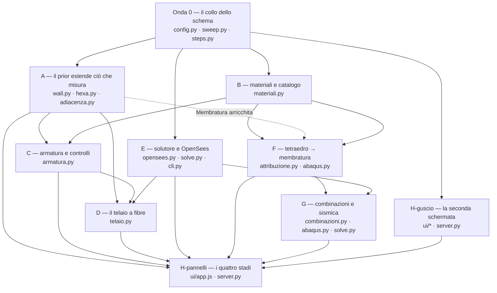

# Fase 8 — Sequenziamento: come si esegue in parallelo ciò che la mappa #127 ha deciso

> **For agentic workers:** questo documento **non è** un piano di implementazione task-per-task. È il documento di sequenziamento che sta **prima** di `superpowers:writing-plans`: dice quali sottosistemi possono correre insieme, quali file ciascuno tocca in esclusiva, con quali firme si parlano, e che cosa nessuna onda può rompere. Il piano di ciascun sottosistema si scrive dopo, uno per sottosistema, dentro la propria onda.

**Goal:** eseguire in parallelo, su sessioni separate, le tredici decisioni chiuse della mappa [#127](https://github.com/maeurong/Tesi/issues/127) senza che due sessioni si trovino a scrivere lo stesso punto dello stesso file, e senza che nessuna sposti l'impronta delle ventidue righe della tabella sperimentale.

**Che cosa contiene:** il grafo delle dipendenze dedotto dai file e dalle firme, le onde di parallelismo, i contratti d'interfaccia fra sottosistemi, i punti di collisione con la loro strategia, l'invariante da riverificare dopo ogni onda, l'ordine consigliato, e i punti in cui il lavoro si ferma perché una decisione non c'è.

**Spec:** la mappa wayfinder [#127](https://github.com/maeurong/Tesi/issues/127) e i suoi diciannove ticket chiusi, [#128](https://github.com/maeurong/Tesi/issues/128)–[#146](https://github.com/maeurong/Tesi/issues/146). Ogni ticket porta in commento la decisione presa con il proprio ragionamento: **sono la specifica, e questo documento non le riapre.**

---

## Global Constraints

- **Comandi.** Tutti da `meshrec/`. La suite si lancia con `uv run pytest tests -q --ignore=tests/feasibility`.
- **Sola lettura:** `experiments/muro/`, `experiments/lab_crop/`. Le corse di riferimento `runs/muro/` e `runs/lab_crop/` **non sono presenti su questa macchina** — `runs/` contiene `default`, `pr2`, `prova` (verificato in questa sessione). Il vincolo di provenienza che governa tutto il documento è quello dei **registri**, non delle corse.
- **Mai `git add -A`:** ogni commit elenca i file. Le sessioni parallele lavorano su rami distinti (`feat/<slug>`), e un `-A` in una sessione raccoglierebbe i derivati di un'altra.
- **Un'onda che finisce è un'onda che ha passato le review.** Il ciclo obbligatorio (`dev-workflow`) prevede TDD e round di review in parallelo prima del commit: `security-reviewer`, `code-reviewer`, `test-writer`, `craft-reviewer` dispacciati insieme, non in fila. Un ramo che ha il codice verde ma non la review **non ha finito**, e l'onda successiva non parte.
- **Unità:** mm, N, MPa, t, s. Interfaccia in italiano, identificatori tecnici ascii e invariati.
- **La norma è NTC 2018**, con l'Eurocodice 2 dove la NTC vi rimanda (paletto di charting della mappa).
- **I numeri di riga di questo documento scadono.** Ogni `file:riga` citato qui va riaperto e confermato prima di agirci: vale quello che legge chi lavora, non quello che c'è scritto qui.

---

## 0. Premesse verificate, e lo stato dell'albero

Misurato da `/mnt/c/Users/mario/GitHub/Tesi`, branch `main`, HEAD `787fdeb`.

### 0.0 Lo stato al momento in cui questo documento è stato scritto

Il documento è stato pensato per un albero pulito. Non lo era: `git status` all'ora della scrittura (29/08/2026) mostra **lavoro già in corso che ricade su due delle cinque onde**, e chi legge deve saperlo prima di dispacciare.

| cosa | ricade su |
|---|---|
| `docs/superpowers/plans/2026-08-29-meshrec-fase-8-prior-esteso.md` più la sua spec — un piano d'attuazione **già scritto** per il ramo A | **onda 1, ramo A** |
| modifiche in indice a `app/server.py`, `ui/app.js`, `ui/stile.css` (+862 righe con i loro test), più `meshrec/docs/raffinamento-interfaccia-step.md` | **onda 1, ramo H-guscio** e **onda 0** (`server.py`) |
| modifiche in indice a `core/config.py` (5 righe) e `core/pipeline.py` (13 righe) | **onda 0** e **onda 1, ramo A** |

**Conseguenze operative, non riscritture del piano:**

1. **L'onda 0 parte da questo albero, non da `787fdeb`.** Chi la apre rimisura l'invariante di §6 **prima** di toccare `config.py`, perché la base è già cambiata di cinque righe rispetto al commit su cui il documento è stato verificato.
2. **Il ramo A ha già il suo piano.** Non se ne scrive un secondo: `2026-08-29-meshrec-fase-8-prior-esteso.md` è l'autorità, e §4.3 di questo documento va letta come contratto verso i consumatori (C, D, F, H), non come istruzione per A.
3. **`app/server.py` e `ui/` hanno già un autore in corso.** L'esclusiva che §5 assegna a H vale da subito: nessun altro ramo li apra finché quel lavoro non è chiuso.

### 0.1 Le premesse del brief, riaperte e confermate

| affermazione | esito |
|---|---|
| `core/wall.py` — `_FETTE_LUNGO_ASSE = 20`, `misura` calcola `per_fetta`, `e1`, `e2` e non li restituisce | **confermata**, `misura` alle righe 469-560 circa; `per_fetta`, `e1`, `e2` sono locali |
| `core/wall.py` — `scomponi`, `prior` che scrive `12_wall.json` | **confermata** |
| `core/hexa.py` — `taglia_giunzioni(prismi) -> tuple[list[Prisma], list[dict]]`, record con `maggiore`, `minore`, `accorciamento`, `cuneo` | **confermata**, più un quinto campo `posizione_tolleranza` che il brief non nomina |
| `core/sweep.py` — `BLOCCHI_FUORI_IMPRONTA = ("run", "wall", "model")`, `BLOCCHI_VUOTI_FUORI_IMPRONTA = ("carichi", "selettori")`, `fingerprint(cfg)` | **confermata** |
| `core/steps.py` — `STEP_KEYS` tredici chiavi, `STEP_BLOCKS` tabella blocco→step | **confermata**, `STEP_BLOCKS[11] = ("tet", "analysis", "carichi", "selettori")`, `STEP_BLOCKS[13] = ("tet", "analysis")` |
| `core/config.py` — `element: Literal["C3D10", "C3D4"]` | **confermata** |
| `core/abaqus.py` — un'unica riga `*SOLID SECTION, ELSET=..., MATERIAL=...` | **confermata**, occorrenza singola |
| ventidue righe nei due registri, ognuna col proprio `fingerprint` e la propria `config` | **confermata**: 11 + 11 = 22, e su tutte e 22 il basename di `out_dir` coincide con `fingerprint[:12]` (verificato con lettura stdlib dei due `registro.jsonl`) |

Due fatti aggiuntivi, letti perché il sequenziamento vi poggia:

- **`core/hexa.py` non importa `core/wall.py`.** Il modulo lo cita solo in prosa, e dichiara in testa il proprio confine: «hexa.py costruisce e non misura: riceve da wall.py sezioni, assi e lunghezze già misurati». `wall` importa `io`, `segment`, `abaqus.fix_sign`, `config`. La direzione è wall → (niente hexa), hexa → (niente wall).
- **`sweep.fingerprint` decide «vuoto» così:** `if not any((payload.get(blocco) or {}).values()): payload.pop(blocco)`. È il predicato esatto su cui poggia l'invarianza delle ventidue righe, e la §6 ne trae la conseguenza operativa.

---

## 1. Copertura della tabella

La decomposizione in otto sottosistemi è presa come data. Verificata contro i ticket, copre **tredici** dei diciannove.

| | sottosistema | ticket | copertura |
|---|---|---|---|
| A | Il prior estende ciò che misura | 142, 143 | piena |
| B | Il modello dei materiali e il catalogo | 135, 141 | piena |
| C | L'armatura e i controlli di sezione | 136 | piena |
| D | Il costruttore del telaio a fibre | 134 | piena, ma **il confine con E è da tagliare** (sotto) |
| E | L'astrazione del solutore e OpenSees | 139, 138, 144 | piena |
| F | Tetraedro → membratura nel solido | 145 | piena |
| G | Combinazioni e sismica | 146 | piena, ma **con una parte non decisa** (§8) |
| H | La schermata dell'analisi | 137, 140 | piena |

### I sei ticket che la tabella non nomina, e perché

[#128](https://github.com/maeurong/Tesi/issues/128), [#129](https://github.com/maeurong/Tesi/issues/129), [#130](https://github.com/maeurong/Tesi/issues/130), [#131](https://github.com/maeurong/Tesi/issues/131), [#132](https://github.com/maeurong/Tesi/issues/132) portano l'etichetta `wayfinder:research`, [#133](https://github.com/maeurong/Tesi/issues/133) l'etichetta `wayfinder:task`. **Nessuno dei sei contiene una decisione**: contengono reperti e una verifica eseguita. Non sono un sottosistema scoperto — sono l'ingresso delle decisioni, e non hanno niente da sequenziare. Restano da consultare come fonte (in particolare #130 per l'idioma delle fibre e #132 per i domini dei campi d'armatura), non da attuare.

### Un pezzo che sta a cavallo di due case: lo scrittore del `.tcl`

Nessun ticket assegna esplicitamente **chi scrive le card della sezione a fibre nel deck OpenSees**. Sono l'intersezione di due sottosistemi:

- D possiede il **modello** — quali elementi, con quale sezione a quale quota, con quale connettività ([#134](https://github.com/maeurong/Tesi/issues/134), [#142](https://github.com/maeurong/Tesi/issues/142), [#143](https://github.com/maeurong/Tesi/issues/143));
- E possiede l'**artefatto** — che il modello esca come `.tcl` eseguibile da chiunque abbia la distribuzione standard, che è la ragione dichiarata per cui `openseespy` è stato scartato ([#139](https://github.com/maeurong/Tesi/issues/139)).

**Non lo si risolve rifacendo la tabella.** Lo si dichiara e si taglia dove il codice già taglia: `core/abaqus.py` è lo scrittore di deck e `core/hexa.py` è il costruttore di modello, e i due sono separati oggi. Per analogia, **E possiede lo scrittore** (`core/opensees.py`: nodi, elementi, materiali, `section Fiber`, `patch rect`, `layer straight`, il blocco d'analisi) e **D possiede ciò che gli si dà da scrivere** (la struttura dati del telaio). Il contratto fra i due è in §4.

---

## 2. Il grafo delle dipendenze reali

Dedotto dai file toccati e dalle firme prodotte o consumate, **non** dalle etichette dei sottosistemi.

### 2.1 I file, e chi li scrive

| file | A | B | C | D | E | F | G | H |
|---|:-:|:-:|:-:|:-:|:-:|:-:|:-:|:-:|
| `core/config.py` | | ● | ○ | | ● | | ● | ● |
| `core/sweep.py` | | ● | | | ● | | ○ | |
| `core/steps.py` | | ● | | | ● | | ○ | |
| `core/wall.py` | ● | | | | | | | |
| `core/hexa.py` | ● | | | | | | | |
| `core/adiacenza.py` *(nuovo)* | ● | | | ○ | | | | |
| `core/materiali.py` *(nuovo)* | | ● | ○ | | | | | |
| `core/armatura.py` *(nuovo)* | | | ● | ○ | | | | |
| `core/telaio.py` *(nuovo)* | | | | ● | | | | |
| `core/opensees.py` *(nuovo)* | | | | ○ | ● | | | |
| `core/combinazioni.py` *(nuovo)* | | | | | | | ● | |
| `core/attribuzione.py` *(nuovo)* | | | | | | ● | | |
| `core/abaqus.py` | | ● | | | ● | ● | ● | |
| `core/solve.py` | | | | | ● | | ● | |
| `core/pipeline.py` | ● | | | ● | | ● | | |
| `core/soglie.py` | ○ | ○ | ○ | | ○ | ○ | ○ | |
| `cli.py` | | | | | ● | | | |
| `app/server.py` | | | | | | | | ● |
| `ui/app.js`, `ui/index.html`, `ui/stile.css` | | | | | | | | ● |

● scrive — ○ legge, o vi scrive solo in via subordinata (vedi §5).

### 2.2 Il grafo



### 2.3 Gli archi, e da quale fatto discendono

| arco | ragione, in un fatto |
|---|---|
| W0 → tutto | quattro sottosistemi aggiungono o cambiano un blocco di `PipelineConfig`, e `sweep.fingerprint` fa `model_dump` sull'intera configurazione: il primo che atterra sposta la base su cui gli altri misurano |
| A → C | `μ_min = 0,26·(f_ctm/f_yk)·b·d` dipende da `b` e `d`, cioè **dalla stazione** ([#136](https://github.com/maeurong/Tesi/issues/136) Q3). Senza le venti sezioni di fetta che A fa uscire da `misura`, C non ha su che cosa pronunciare il verdetto |
| B → C | `f_cd` e `f_yd` si derivano da `f_ck` e `f_yk`, che sono **campi nuovi** e vivono nel blocco nuovo di B ([#141](https://github.com/maeurong/Tesi/issues/141)) |
| B → F | F assegna un materiale per regione: senza la forma «regione → sezione → materiali» di [#135](https://github.com/maeurong/Tesi/issues/135) non ha dove scrivere l'assegnazione |
| A ⇢ F | dipendenza debole: F attribuisce per **baricentro dentro il prisma**, e il prisma nasce da `hexa.prisma_di` sulle membrature che il prior già scrive oggi. F **non** ha bisogno delle sezioni per fetta. L'arco esiste solo perché A cambia `Membratura` e `pipeline._ricostruisci_membrature`, che F attraversa |
| A, C, E → D | il telaio consuma sezioni per stazione (A), adiacenza e nodi (A), armatura per stazione (C), e uno scrittore di deck (E) |
| F → G | collisione di file, non di concetto: entrambi scrivono `core/abaqus.py` (§5) |
| E → G | le combinazioni diventano casi in `casi_di_carico`, che `solve.risolvi` usa per nominare i blocchi del `.frd`; E ha già riscritto quella catena per due solutori |
| tutti → H-pannelli | la schermata mostra numeri che i sottosistemi producono. Un pannello scritto prima del numero è un pannello che mostra un segnaposto |

---

## 3. Le onde di parallelismo

Cinque onde. Il numero fra parentesi è **quante sessioni separate** l'onda ammette davvero.

### Onda 0 — il collo dello schema (1 sessione, sequenziale)

Tutto ciò che tocca `config.py`, `sweep.py`, `steps.py` si fa **qui e una volta sola**, prima che qualunque cosa vada in parallelo. È la mossa che rende possibile tutto il resto: dopo, quei tre file escono dalla matrice delle collisioni.

| cosa | ticket | file |
|---|---|---|
| blocco `solutore` (nome + percorso facoltativo), in `BLOCCHI_FUORI_IMPRONTA` **e** in `STEP_BLOCKS[13]` | [#139](https://github.com/maeurong/Tesi/issues/139) | `config.py`, `sweep.py`, `steps.py` |
| blocco nuovo delle regioni/sezioni/materiali/armature, in `BLOCCHI_VUOTI_FUORI_IMPRONTA` **e** in `STEP_BLOCKS` degli step che lo leggono | [#135](https://github.com/maeurong/Tesi/issues/135), [#141](https://github.com/maeurong/Tesi/issues/141), [#136](https://github.com/maeurong/Tesi/issues/136) | `config.py`, `sweep.py`, `steps.py` |
| `natura` dell'azione e schema delle combinazioni dentro `carichi` (già in `BLOCCHI_VUOTI_FUORI_IMPRONTA`) | [#146](https://github.com/maeurong/Tesi/issues/146) | `config.py` |
| `RunConfig.to_step` predefinito 13 → 12, e la descrizione riscritta perché smetta di affermare la coincidenza col tetto | [#140](https://github.com/maeurong/Tesi/issues/140) | `config.py` |
| `/api/schema` regge i blocchi nuovi | conseguenza | `app/server.py` |

**Perché in una sessione sola e sequenziale.** Quattro modifiche allo stesso file, e ciascuna sposta l'impronta se sbagliata. Farle in parallelo significa quattro rami che riscrivono `PipelineConfig` e quattro merge da riconciliare a mano sull'unico artefatto che la tesi non può permettersi di muovere.

**Esclusiva:** `core/config.py`, `core/sweep.py`, `core/steps.py`, `app/server.py`.

---

### Onda 1 — quattro rami indipendenti (4 sessioni, parallele)

| ramo | contenuto | file in esclusiva |
|---|---|---|
| **A** | `misura` restituisce le venti sezioni di fetta, la base `e1`/`e2` e la quota di ciascuna fetta; l'adiacenza estratta da `taglia_giunzioni` e scritta in `12_wall.json`; il nodo per proiezione con la distanza mostrata | `core/wall.py`, `core/hexa.py`, **`core/adiacenza.py`** (nuovo), `core/pipeline.py`, `tests/test_wall.py`, `tests/test_hexa.py`, `tests/test_pipeline.py` |
| **B-catalogo** | il catalogo dei materiali nella forma di `soglie.py` — voce con `fonte`, `origine`, `fissata`, `nota` — e i test che rifiutano la voce senza fonte o giustificata da sé | **`core/materiali.py`** (nuovo), `tests/test_materiali.py` (nuovo) |
| **E-solutore** | `core/opensees.py` (scrittore `.tcl` + lettore delle uscite); i sette controlli di `solve` portati al secondo solutore con la **tabella di quale controllo vale su quale modello**; `write_vtu` con i dati per cella; percorso dichiarabile per `ccx` **e** OpenSees; `meshrec dottore` come sottocomando | **`core/opensees.py`** (nuovo), `core/solve.py`, `cli.py`, `core/abaqus.py:write_vtu`, `tests/test_solve.py`, `tests/test_cli.py` |
| **H-guscio** | la colonna della pipeline scende a dodici step e si chiude con un collegamento; la seconda schermata esiste, vuota, con i quattro stadi in ordine di dipendenza | `ui/index.html`, `ui/app.js`, `ui/stile.css`, `ui/viewport.js`, `app/server.py`, `tests/test_app_js.py`, `tests/test_stile.py`, `tests/test_server.py` |

**Disgiunzione verificata.** A non tocca `abaqus.py`; E tocca `abaqus.py` solo in `write_vtu` (riga ~1625), che nessun altro ramo dell'onda apre; H è l'unico che tocca `ui/` e `app/server.py`; B-catalogo è un file nuovo e il suo test.

**Il punto di attrito dichiarato:** A tocca `core/pipeline.py` (per `_ricostruisci_membrature`, che mappa il dizionario del prior sui quindici campi di `Membratura`). Nessun altro ramo dell'onda 1 tocca `pipeline.py`. Resta esclusiva di A per tutta l'onda.

---

### Onda 2 — due rami (2 sessioni, parallele)

| ramo | contenuto | file in esclusiva |
|---|---|---|
| **C** | i nove campi dichiarati, i tre derivati, i controlli `μ` / `μ_min` / `μ_bil` / `ε_ud` **per stazione**, il verdetto `fragile`/`duttile`/`oltre la bilanciata`, le due guardie geometriche che fermano | **`core/armatura.py`** (nuovo), `tests/test_armatura.py` (nuovo), `tests/test_config.py` per i domini |
| **F** | mappa tetraedro → membratura per baricentro, conteso alla maggiore, orfano ad `analysis.material`, le quattro misure da mostrare; `ALL_WALL` partizionato in `*ELSET` per regione e molte righe `*SOLID SECTION` | **`core/attribuzione.py`** (nuovo), `core/abaqus.py` (la riga `*SOLID SECTION` e il parametro `elset`), `core/pipeline.py`, `tests/test_abaqus.py` |

**Perché non tre rami.** G vorrebbe partire qui, ma scrive `core/abaqus.py` come F. Due sottosistemi che scrivono lo stesso file non sono paralleli anche se il concetto è indipendente: G va in onda 3.

---

### Onda 3 — due rami (2 sessioni, parallele)

| ramo | contenuto | file in esclusiva |
|---|---|---|
| **D** | il telaio: venti elementi per membratura con la sezione della propria fetta, nodi dall'adiacenza, lunghezza di calcolo da nodo a nodo, armatura riposizionata a ogni stazione | **`core/telaio.py`** (nuovo), `core/pipeline.py`, `tests/test_telaio.py` (nuovo) |
| **G** | la natura dell'azione, le combinazioni NTC 2018 proposte e correggibili, i casi singoli che restano, la sismica statica equivalente; la scrittura di più azioni dentro un `*STEP` solo; `casi_di_carico` esteso con l'ordine preservato | **`core/combinazioni.py`** (nuovo), `core/abaqus.py` (`_passo_statico`, riga ~121), `core/solve.py`, `tests/test_abaqus.py`, `tests/test_solve.py` |

**Il punto di attrito dichiarato:** entrambi possono voler toccare `core/pipeline.py`. Assegnata a **D** in esclusiva per l'onda; G passa dalla configurazione e da `abaqus`, non dalla pipeline. Se in attuazione G scopre di dover toccare `pipeline.py`, **si ferma e lo dice** invece di aprirlo.

**La parte di G che non parte:** la modale con spettro. Vedi §8.

---

### Onda 4 — un ramo (1 sessione)

| ramo | contenuto | file in esclusiva |
|---|---|---|
| **H-pannelli** | i quattro stadi riempiti: modello con il solutore sulla diagonale, struttura con il verdetto per stazione, pre-processore con vincoli/carichi/combinazioni/sismica, post-processore. Le tre grandezze che i ticket obbligano a mostrare: `riempimento_sezione`, distanza di proiezione, frazione orfana | `ui/app.js`, `ui/index.html`, `ui/stile.css`, `app/server.py`, `tests/test_app_js.py`, `tests/test_server.py` |

**Perché sola.** Tutto ciò che H mostra è un numero che qualcun altro produce. Un pannello scritto prima del numero è un pannello che mostra un segnaposto, e un segnaposto in questa applicazione è precisamente il difetto che il progetto è costruito per non produrre.

---

### Riepilogo delle onde

| onda | sessioni | rami | dura finché |
|---|:-:|---|---|
| 0 | 1 | schema | l'invariante di §6 è riverificato e verde |
| 1 | 4 | A, B-catalogo, E-solutore, H-guscio | tutti e quattro hanno passato le review |
| 2 | 2 | C, F | entrambi hanno passato le review |
| 3 | 2 | D, G | entrambi hanno passato le review |
| 4 | 1 | H-pannelli | — |

---

## 4. I contratti d'interfaccia

Chi attua un sottosistema vede solo il proprio. **Questa sezione è il modo in cui impara i nomi che i vicini useranno.** Le firme sono normative: chi le cambia lo dichiara e avvisa gli altri rami, perché nessuno se ne accorgerebbe finché il merge non fallisce.

### 4.0 Che cosa è cambiato mentre i rami costruivano

> Scritto il 30/08/2026, ad attuazione in corso. **Le §4.3–§4.9 qui sotto sono il
> contratto come è stato *previsto*; questa sezione è il contratto come è *uscito*.
> Dove le due divergono, vale questa.** §4.2 lo pretendeva: «se l'onda 0 li cambia,
> lo dice qui prima di chiudere», e valeva per ogni ramo, non solo per l'onda 0.

**Dall'onda 0 (lo schema).**

- **`veste` non esiste**, e non va scritto. §4.4 lo dava obbligatorio su
  `MaterialeDichiarato`. Mario ha deciso che vale [#141](https://github.com/maeurong/Tesi/issues/141)
  senza eccezioni: le voci sono **sempre caratteristiche** e il programma deriva i
  valori di progetto con i γ di norma. Le parole «già ridotte» di
  [#146](https://github.com/maeurong/Tesi/issues/146) riguardavano il fattore di
  confidenza e il livello di conoscenza, che non si applicano perché il materiale è
  calcestruzzo e non muratura. Un test sorveglia contro la reintroduzione.
- Di conseguenza `f_k` è **sempre caratteristico**, non «caratteristico o ridotto»
  come §4.4 scriveva.
- **`classe_calcestruzzo` è `str` e non un'enumerazione.** §4.5 la voleva chiusa «da
  C8/10 in su», ma il catalogo è del ramo B, e un'enumerazione scritta a mano nella
  configurazione sarebbe una seconda verità che diverge dalla prima.
- **`diametro_teso`, `diametro_compresso` e `diametro_staffe` sono interi con un
  dominio**, non l'enumerazione EN 10080 ∩ NTC 11.3.2.4 che §4.5 nominava. Stessa
  ragione. Chi compila legge la serie commerciale nella descrizione del campo; chi
  vuole il menù lo costruisce nell'interfaccia, dove la serie è un fatto di
  presentazione e non un secondo dominio.

**Dal ramo A (il prior).** Il piano d'attuazione di A è autorità su §4.3, e ha
fissato nomi diversi. **Questi sono i nomi veri:**

| §4.3 diceva | è | nota |
|---|---|---|
| `sezioni_per_fetta` | `sezioni_fette` | `(n, 2)` float64, mm. Colonna 0 lungo **e1**, colonna 1 lungo **e2** |
| `quote_per_fetta` | `quote_fette` | `(n,)` float64, mm dall'origine. Stessa lunghezza e stesso ordine |
| `e1`, `e2`, due campi `(3,)` | `base_sezione`, un campo `(2, 3)` | riga 0 = e1, riga 1 = e2. Nascono insieme e insieme sono un piano |
| chiave JSON `adiacenza` | chiave `giunzioni` | di primo livello in `12_wall.json` |
| `maggiore` / `minore` | `cede` / `resta` | il Ruling AD assegna il ruolo **per invasione**, non per area: «maggiore» sarebbe un nome falso |
| — | `distanza_proiezione` | float, mm, ≥ 0. Si misura e si mostra; **non** è una soglia |
| `core/adiacenza.py` | **non creato** | `ruoli_dell_incontro`, `nodo_di_giunzione` e `giunzioni` vivono in `core/wall.py` |

`quote_fette` è la quota del **centro geometrico** della fetta, non la media dei
punti. `n ≤ 20`: una fetta con meno di quattro punti non produce riga, e il numero
dichiarato è quello vero.

**Un'incoerenza dichiarata e non risolta, che riguarda D.** `wall.giunzioni` ordina
per area del **rettangolo circoscritto**; `hexa.taglia_giunzioni` usa l'area del
**contorno misurato**. Su una sezione non rettangolare i due possono assegnare ruoli
diversi allo stesso incontro. Sono due letture a risoluzione diversa, non due copie:
chi costruisce il telaio dai nodi di uno e le sezioni dell'altro deve saperlo.

**Dal ramo E (il solutore).**

- **`leggi_uscite` non produce mai un `VM_` sul telaio.** §4.6 lo prometteva in prosa,
  ma la tabella controllo × modello che [#138](https://github.com/maeurong/Tesi/issues/138)
  obbliga a scrivere dichiara il controllo `picco` **non applicabile** al telaio: la
  tensione lì vive per fibra, non per nodo. Vale la tabella.
- **§4.6 e §4.7 non chiudono, e la casella è vuota.** `scrivi_tcl` riceve
  `casi_di_carico`, ma il `Telaio` di §4.7 non porta le azioni con cui scriverli, e
  §4.9 le assegna a G, due onde dopo. E scrive il peso proprio e il blocco modale — i
  soli derivabili dal telaio — e **rifiuta** ogni altro nome nominando a chi
  appartiene. Uno `*STEP` senza carichi darebbe spostamenti nulli e sette verdetti
  verdi su un modello mai caricato. **Va deciso da chi ricongiunge D, E e G.**
- **Tre cose che `Telaio` non porta e che E ha dedotto**, dichiarandole: i vincoli
  (regola usata: i nodi alla quota minima, come `BASE`), il numero di modi (keyword
  con predefinito letto dalla configurazione), e il nome del caso di peso proprio (il
  primo della lista, per la convenzione già documentata). **Se D vuole altro, è
  `Telaio` che deve portarlo.**
- **Il codice d'uscita non è il segnale.** Misurato: OpenSees esce `0` anche dopo un
  errore fatale, e `ccx` esce `201` quando funziona. Nessun ramo concluda «riuscito»
  da un codice.
- **OpenSees non si invoca dalla sua cartella `bin/`.** Misurato: carica le DLL da
  qualunque cwd. E **non deve** essere invocato da lì, perché i registratori scrivono
  con nomi relativi alla cartella corrente e le uscite finirebbero dentro
  l'installazione invece che nella cartella della corsa.

**Dal ramo B (il catalogo).** Tre divergenze fra fonti, decise e scritte nelle note
delle voci: `E_s = 200.000 MPa` (non i 210.000 della Circolare, che stanno in un
paragrafo sulle tensioni in esercizio, e con cui l'oracolo di collaudo fallisce);
`E_cm` presa dalla formula e non dalla tabella pubblicata altrove; e `f_ck` letto dal
**nome della classe**, perché «C25/30» *è* la coppia normalizzata e `0,83·R_ck`
sbaglia fino al 6,7% su C35/45. Nessuna delle sei riduzioni ulteriori previste dalla
norma è attuata: ognuna dipende da un fatto che una riga di catalogo non porta, e
quando serviranno entreranno come **argomenti espliciti**, mai come predefiniti
silenziosi.

---

### 4.1 Ciò che esiste oggi e non cambia

Verificato in questa sessione. Chi scrive un contratto nuovo lo scrive **accanto** a questi, non al loro posto.

```python
# core/wall.py
def misura(punti_regione: np.ndarray, direzioni: np.ndarray, cfg: WallConfig) -> Membratura
def prior(points: np.ndarray, cfg_segment: SegmentConfig, cfg: WallConfig,
          spacing: float) -> dict[str, object]
def scomponi(points, cfg_segment, cfg, spacing) -> tuple[
    list[np.ndarray], dict[str, object], np.ndarray, np.ndarray, np.ndarray]

@dataclass(eq=False)
class Membratura:
    punti: np.ndarray;              asse: np.ndarray
    origine: np.ndarray;            lunghezza: float
    sezione: tuple[float, float];   sezione_dispersione: tuple[float, float]
    contorno: np.ndarray;           fuori_piombo_deg: float
    asse_ideale: np.ndarray;        scarto_asse_deg: float
    rigonfiamento: np.ndarray;      volume: float
    riempimento_sezione: float;     riempimento_stato: str
    densita_dispersione: float;     esiti: dict[str, dict]

# core/hexa.py
@dataclass(eq=False)
class Prisma:
    contorno: np.ndarray; origine: np.ndarray; asse: np.ndarray; lunghezza: float

def prisma_di(membratura, tipo: str) -> Prisma          # tipo: "estruso" | "ideale"
def dentro(prisma: Prisma, punti: np.ndarray, tolleranza: float = 0.0) -> np.ndarray
def taglia_giunzioni(prismi: list[Prisma]) -> tuple[list[Prisma], list[dict[str, object]]]
# record di giunzione: {"maggiore": int, "minore": int, "accorciamento": float,
#                       "cuneo": float, "posizione_tolleranza": float}

# core/pipeline.py
def calcola_prior(out: Path, cfg: PipelineConfig, points: np.ndarray,
                  spacing: float) -> dict[str, object]

# core/abaqus.py
def export_model(path_inp, path_vtu, nodes, elements, cfg: AnalysisConfig,
                 tet_cfg: TetConfig, reference=None, element_type=None,
                 element_surfaces=None, ties=(), pressure=None,
                 carichi: CarichiConfig | None = None,
                 selettori: dict[str, Selettore] | None = None) -> dict[str, object]

# core/solve.py
def risolvi(out_dir: Path, deck: Path, cfg: AnalysisConfig, nodes, elements,
            element_type: str, *, casi_di_carico: list[str],
            vincolo_in_pianta: dict[str, float],
            trasformata) -> dict[str, object]

# core/config.py — congelato dall'impronta, non si tocca
class Material(_ModelloBase):
    name: NomeSet; young: float; poisson: float; density: float
class AnalysisConfig(_ModelloBase):
    material: Material; gravity: float; fixed_nset: NomeSetDiFaccia
    step_name: NomeSet; set_tolerance_factor: float

# core/soglie.py — la forma che B, C, G devono imitare
class Soglia(NamedTuple):
    nome: str; minimo: float | None; massimo: float | None; unita: str
    tipo: Literal["cancello", "etichetta", "parametro"]
    origine: Origine; fonte: str; fissata: date; nota: str = ""
```

### 4.2 Onda 0 → tutti: i nomi dei blocchi

Il resto del lavoro cita questi nomi. **Se l'onda 0 li cambia, lo dice qui prima di chiudere.**

```python
# core/config.py — blocchi nuovi di primo livello su PipelineConfig
class SolutoreConfig(_ModelloBase):
    nome: Literal["calculix", "opensees"] = "calculix"
    percorso: Path | None = None      # None = «cercalo nel PATH»

class PipelineConfig(_ModelloBase):
    ...
    solutore: SolutoreConfig = Field(default_factory=SolutoreConfig)
    regioni: dict[NomeSet, RegioneConfig] = Field(default_factory=dict)

# core/sweep.py
BLOCCHI_FUORI_IMPRONTA        = ("run", "wall", "model", "solutore")
BLOCCHI_VUOTI_FUORI_IMPRONTA  = ("carichi", "selettori", "regioni")

# core/steps.py
STEP_BLOCKS[11] = ("tet", "analysis", "carichi", "selettori", "regioni")
STEP_BLOCKS[13] = ("tet", "analysis", "solutore")
```

> **Attenzione, e vale come vincolo:** `SolutoreConfig` ha `nome` con predefinito **truthy**. Questo è ammissibile **solo** perché `solutore` sta in `BLOCCHI_FUORI_IMPRONTA` (esclusione secca). Un campo con predefinito truthy dentro `regioni` o dentro `carichi` renderebbe il blocco **sempre non vuoto** e sposterebbe le ventidue righe. Vedi §6.

### 4.3 A → C, D, F, H: che cosa il prior comincia a restituire

```python
# core/wall.py — nuovi campi su Membratura
@dataclass(eq=False)
class Membratura:
    ...  # i quindici campi di oggi, invariati
    sezioni_per_fetta: np.ndarray   # (n, 2) float — le due estensioni di ogni fetta
                                    # misurata; n ≤ 20, le fette con meno di 4 punti
                                    # non producono una riga
    quote_per_fetta: np.ndarray     # (n,) float — la quota lungo l'asse del centro
                                    # di ciascuna fetta, in mm dall'origine
    e1: np.ndarray                  # (3,) versore, base del piano di sezione,
    e2: np.ndarray                  # (3,) ancorata alla terna del pezzo, non alla
                                    # SVD della regione
```

```jsonc
// 12_wall.json — chiavi nuove. Le corse vecchie non le portano:
// assente vuol dire assente, e non si fabbrica.
{
  "membrature": [
    {
      "...": "le chiavi di oggi, invariate",
      "sezioni_per_fetta": [[b, h], ...],   // list[list[float]], mm
      "quote_per_fetta":   [z, ...],        // list[float], mm dall'origine
      "e1": [x, y, z],
      "e2": [x, y, z]
    }
  ],
  "adiacenza": [
    {
      "maggiore": 0,                   // indice nella lista `membrature`
      "minore": 2,
      "nodo": [x, y, z],               // proiezione del minore sull'asse del maggiore
      "distanza_proiezione": 41.7,     // mm — si misura e si mostra, non si tace
      "quota_maggiore": 1830.0,        // ascissa del nodo sull'asse del maggiore, mm
      "estremo_minore": "origine"      // "origine" | "fine"
    }
  ]
}
```

```python
# core/adiacenza.py (nuovo) — l'estrazione richiesta da #143
def coppie(prismi: list[Prisma]) -> list[dict[str, object]]:
    """Le coppie di prismi che si incontrano, con maggiore, minore e cuneo.

    È il calcolo che oggi vive dentro `hexa.taglia_giunzioni`, estratto perché
    il prior e il telaio lo chiamino senza duplicarlo. `hexa.taglia_giunzioni`
    lo chiama e continua ad accorciare come oggi.
    """

def nodo_di_giunzione(maggiore: Prisma, minore: Prisma) -> dict[str, object]:
    """Il nodo come proiezione dell'estremo del minore sull'asse del maggiore.

    Restituisce {"nodo", "distanza_proiezione", "quota_maggiore", "estremo_minore"}.
    Solleva sul soffitto ereditato: attraversamento da parte a parte e
    contenimento completo, con lo stesso messaggio di `hexa.taglia_giunzioni`.
    """
```

> **Il vincolo, e ciò che ne discende.** `core/hexa.py` dichiara in testa che «riceve da wall.py sezioni, assi e lunghezze già misurati», e verificato in questa sessione: `hexa` non importa `wall`, `wall` non importa `hexa`. Il verso ammesso dal confine è dunque **hexa → wall**, non il contrario. Se l'estrazione restasse in `hexa`, `wall.prior` dovrebbe importare `hexa` e invertirebbe quel confine: questa è l'unica via **esclusa**.
>
> Restano due vie ammesse, e la scelta fra loro non è di questo documento: metterla **in `wall`** (che è la direzione dichiarata, ma va sciolto che `Prisma` è definito in `hexa` e non si può importare all'indietro), oppure in un **terzo modulo** che entrambi importano. Il nome `core/adiacenza.py` usato qui è un segnaposto per la seconda via; se il piano del ramo A sceglie la prima, i contratti di §4.3 valgono identici con `wall.` al posto di `adiacenza.`, e questa sezione va corretta invece che seguita.
>
> **Nota di stato:** un piano d'attuazione per il ramo A esiste già — `docs/superpowers/plans/2026-08-29-meshrec-fase-8-prior-esteso.md`, con la sua spec accanto — e sceglie la prima via. **Quel piano è l'autorità per il ramo A**: dove diverge da questa sezione, vale lui.

### 4.4 B → C, D, F, H: materiali e provenienza

```python
# core/materiali.py (nuovo) — la forma di soglie.py, non una forma nuova
class VoceMateriale(NamedTuple):
    classe: str            # "C25/30", "B450C", ...
    famiglia: Literal["calcestruzzo", "acciaio"]
    young: float           # E_cm [MPa] — EC2, 22000·(f_cm/10)^0,3
    poisson: float
    density: float         # [t/mm³] — NTC Tab. 3.1.I
    f_k: float             # f_ck o f_yk [MPa] — sempre CARATTERISTICO
    fonte: str             # l'articolo, non la dispensa
    origine: Literal["letta", "derivata", "nostra"]
    fissata: date
    nota: str = ""

CATALOGO: tuple[VoceMateriale, ...] = (...)

def trova(classe: str) -> VoceMateriale
def valori_di_progetto(voce: VoceMateriale) -> dict[str, float]
    # calcestruzzo: {"f_cd": 0.85 * f_ck / 1.5}
    # acciaio:      {"f_yd": f_yk / 1.15}
```

```python
# core/config.py — dentro il blocco `regioni` deciso dall'onda 0
class MaterialeDichiarato(_ModelloBase):
    """Il materiale di una regione, con ciò che dichiara di sé."""
    material: Material                                   # il modello congelato, riusato
    f_k: float | None = None                             # [MPa], caratteristico o ridotto
    provenienza: Literal["catalogo", "a_mano"] = ...     # #141, «da dove viene»
    classe: str | None = None                            # la voce del catalogo, se catalogo
    norma: str = ...                                     # #141, «con quale norma»
    veste: Literal["caratteristica", "gia_ridotta"] = ...  # #141/#146, «la veste»

class SezioneConfig(_ModelloBase):
    calcestruzzo_confinato: MaterialeDichiarato
    calcestruzzo_copriferro: MaterialeDichiarato
    acciaio: MaterialeDichiarato
    armatura: ArmaturaConfig | None = None               # da C, §4.5

class RegioneConfig(_ModelloBase):
    """Una regione punta a una sezione; la sezione nomina i materiali (#135 Q1)."""
    membratura: int                                      # indice nel prior
    sezione: SezioneConfig
```

> **`analysis.material` resta dov'è**, come materiale unico della corsa monomaterica ([#135](https://github.com/maeurong/Tesi/issues/135)) e come materiale dell'orfano ([#145](https://github.com/maeurong/Tesi/issues/145)). Non è debito.

### 4.5 C → D, H: armatura e verdetto

```python
# core/config.py — dentro SezioneConfig
class ArmaturaConfig(_ModelloBase):
    """I nove campi dichiarati dall'operatore (#136 Q1). Base e altezza NON ci sono:
    vengono da wall.misura, e chiederle disferebbe il programma."""
    classe_calcestruzzo: str            # enum, da C8/10 in su — NTC Tab. 4.1.I
    classe_acciaio: Literal["B450A", "B450C"]           # NTC 11.3.2.1-2
    barre_tese: int                     # ≥ 2 — ISO 3766 §3
    diametro_teso: int                  # mm, enum EN 10080 ∩ NTC 11.3.2.4
    barre_compresse: int                # ≥ 0; 0 = armatura semplice
    diametro_compresso: int             # mm, stessa enum
    diametro_staffe: int                # mm, ≥ 6 e ≥ Ø_long,max/4 — NTC 4.1.6.1.2
    passo_staffe: float                 # mm, > 0 — NTC 4.1.6.1.2
    copriferro_nominale: float          # mm, ≥ 10 — netto, staffe comprese

# core/armatura.py (nuovo)
class BarraCollocata(NamedTuple):
    y: float; z: float; diametro: float   # coordinate nel piano (e1, e2) della stazione

def colloca(armatura: ArmaturaConfig, sezione: tuple[float, float]) -> list[BarraCollocata]
    """Le posizioni delle barre a UNA stazione. Non sono un dato: sono un derivato
    per stazione (#136 Q2). Solleva se le barre non ci stanno — l'unica guardia
    che ferma, perché è geometria impossibile, non norma disattesa."""

class VerdettoStazione(NamedTuple):
    quota: float                        # mm dall'origine dell'asse
    b: float; h: float; d: float        # mm — d = H − c − Ø_st − Ø_long/2
    mu: float; mu_min: float; mu_bil: float
    verdetto: Literal["fragile", "duttile", "oltre_la_bilanciata"]
    interferro_netto: float             # mm, calcolato e mostrato
    copriferro_netto: float             # mm, quello vero, non quello dichiarato

def verdetti(armatura: ArmaturaConfig, sezioni_per_fetta: np.ndarray,
             quote_per_fetta: np.ndarray, f_cd: float, f_yd: float,
             f_ctm: float, f_yk: float) -> list[VerdettoStazione]
    """Un verdetto per stazione, non uno per membratura (#136, conseguenza finale).
    Riferisce e non ferma: una sezione fragile è un risultato, e il modello si
    costruisce comunque."""
```

Oracolo di collaudo già pubblicato in [#136](https://github.com/maeurong/Tesi/issues/136): `R_ck = 30`, B450C → `f_cd = 14,11 MPa`, `k_bil = 0,641`, `μ_bil ≈ 1,87 %`.

### 4.6 E → D, G, H: il solutore

```python
# core/opensees.py (nuovo)
def scrivi_tcl(path: Path, telaio: Telaio, *, casi_di_carico: list[str]) -> dict[str, object]
    """Il gemello del .inp: un file che chiunque abbia la distribuzione standard
    esegue (#139 Q2). Restituisce il resoconto per metrics, come write_inp."""

def leggi_uscite(out_dir: Path, telaio: Telaio) -> dict[str, np.ndarray]
    """I risultati nelle stesse convenzioni del contratto già in casa:
    U_<CASO> e VM_<CASO> per nodo, MODO_<n> per nodo, e per il telaio
    N_<CASO>, V_<CASO>, M_<CASO> per CELLA (#138 Q2). Un blocco modale non
    produce mai U_/VM_."""

# core/solve.py — la superficie che si estende
def eseguibile(cfg: SolutoreConfig) -> Path | None
    """Il percorso dichiarato, altrimenti shutil.which. Vale per ccx e per
    OpenSees: il percorso dichiarabile oggi manca a entrambi (#139)."""

def disponibilita(cfg: SolutoreConfig) -> dict[str, dict[str, object]]
    """Lo sguardo rapido dell'avvio: c'è / non c'è, e da dove (#144 Q1).
    Non esegue niente. Un solutore assente non è un difetto."""

def verifica(cfg: SolutoreConfig) -> dict[str, object]
    """La prova vera, al momento di scegliere: esegue il binario e guarda che
    risponda. «C'è» non è «funziona» (#144 Q1). Stessa misura che
    tests/feasibility/test_calculix.py già fa — una implementazione, non due."""

CONTROLLI_PER_MODELLO: dict[str, dict[str, str]]
    """La tabella esplicita che #138 Q3 obbliga a scrivere PRIMA di implementare:
    per ogni controllo dei sette e per ogni modello (solido, telaio),
    "vale" | "non vale: <ragione>". La validità dipende dal MODELLO, non solo
    dal solutore."""
```

### 4.7 D → H: il telaio

```python
# core/telaio.py (nuovo)
class ElementoTelaio(NamedTuple):
    membratura: int                   # indice nel prior
    stazione: int                     # 0..19
    nodo_i: int; nodo_j: int          # indici in Telaio.nodi
    sezione: tuple[float, float]      # b, h della PROPRIA fetta — non `sezione`,
                                      # non `medie`: la terza, quella locale (#142 Q2)
    e1: np.ndarray; e2: np.ndarray
    barre: list[BarraCollocata]       # da armatura.colloca, a QUESTA stazione
    riempimento_sezione: float        # si mostra accanto: dice di quanto il
                                      # rettangolo sta semplificando (#142 Q3)

class Telaio(NamedTuple):
    nodi: np.ndarray                  # (m, 3)
    elementi: list[ElementoTelaio]
    giunzioni: list[dict[str, object]]   # dall'adiacenza del prior
    materiali: dict[int, SezioneConfig]  # per membratura

def costruisci(prior: dict[str, object], regioni: dict[str, RegioneConfig]) -> Telaio
    """Venti elementi per membratura, 1:1 con le fette che il prior misura.
    Nessun parametro da tarare, quindi nessuno studio di convergenza (#142 Q1).
    Lunghezza di calcolo da nodo a nodo, non faccia a faccia (#143 Q3)."""
```

### 4.8 F → H: l'attribuzione nel solido

```python
# core/attribuzione.py (nuovo)
def attribuisci(nodes: np.ndarray, elements: np.ndarray,
                prismi: list[Prisma]) -> tuple[np.ndarray, dict[str, object]]
    """Per ogni tetraedro l'indice della membratura, o -1 se orfano.

    Baricentro dentro il prisma (#145 Q1). Conteso alla membratura MAGGIORE,
    riusando il Ruling AD (#145 Q2). Orfano ad analysis.material (#145 Q3).
    Coordinate già comuni: align_to_axes è solo allo step 11.

    Il secondo valore è il resoconto, che si mostra e non si tace:
      {"elementi_per_regione": {...}, "volume_per_regione": {...},
       "frazione_orfana": float, "contesi_risolti": int}
    """

# core/abaqus.py — write_inp acquista la molteplicità
#   elset: str = "ALL_WALL"  →  regioni: dict[str, np.ndarray] | None = None
# ALL_WALL resta (PRODUCT.md lo elenca fra i letterali da preservare) e diventa
# l'insieme che le regioni partizionano. Una riga *SOLID SECTION per regione.
```

### 4.9 G → H: combinazioni

```python
# core/config.py — dentro CarichiConfig
Natura = Literal["permanente_strutturale", "permanente_non_strutturale", "variabile"]
# ogni azione dichiara la propria natura: senza, nessun coefficiente si sceglie
# da solo (#146 Q1)

class Combinazione(_ModelloBase):
    nome: NomeSet
    tipo: Literal["slu_fondamentale", "sle_rara", "sle_frequente",
                  "sle_quasi_permanente", "sismica"]
    termini: tuple[tuple[str, float], ...]   # (nome dell'azione, coefficiente)
    proposta: bool                           # True = generata dal programma e non
                                             # ancora toccata dall'operatore

# core/combinazioni.py (nuovo) — la forma di soglie.py per i coefficienti di norma
def proponi(azioni: dict[str, Natura], categoria_uso: str) -> list[Combinazione]
    """Genera le combinazioni NTC 2018 dalle nature dichiarate. Il programma
    propone, l'operatore corregge (#146 Q1): non può sapere la categoria d'uso
    di un edificio rilevato, e generare senza chiedere sarebbe indovinare."""

# core/abaqus.py — `casi_di_carico` cresce: le combinazioni entrano DOPO i casi
# singoli, e l'ordine è un contratto col lettore del .frd — «un ordine diverso da
# quello del deck scambierebbe i risultati».
```

---

## 5. I punti di collisione, e la strategia

| # | punto | chi | strategia |
|---|---|---|---|
| 1 | **`core/config.py`** — quattro sottosistemi vi aggiungono o cambiano qualcosa | B, C, E, G, H | **Sequenza, non parallelismo.** Tutto in onda 0, una sessione. Dopo, `config.py` è chiuso per il resto del lavoro: C e G vi tornano solo per i campi interni ai modelli già dichiarati, e lo fanno nelle proprie onde disgiunte |
| 2 | **`sweep.BLOCCHI_*` contro `steps.STEP_BLOCKS`** — le due liste sono la stessa conoscenza scritta due volte, e il commento in `sweep.py` avverte che «possono divergere in silenzio, ed è così che l'esclusione di `carichi` è sopravvissuta» | B, E, G | **Si toccano nello stesso commit, mai in due.** Onda 0. Il test `test_i_blocchi_nuovi_stanno_in_pipelineconfig_e_nella_lista_di_esclusione_giusta` è la guardia e va **esteso** con i blocchi nuovi: oggi asserisce insiemi letterali (`{"run","wall","model"}`, `{"carichi","selettori"}`), quindi cadrà appena il blocco nuovo entra, ed è giusto che cada — è il momento in cui si dichiara la scelta invece di lasciarla accadere |
| 3 | **`core/abaqus.py`, la riga `*SOLID SECTION` e il parametro `elset="ALL_WALL"`** — B decide la molteplicità, F la produce | B, F | **Sequenza: B decide la forma in onda 0/1, F la scrive in onda 2.** Nessun altro ramo apre quella funzione mentre F ci lavora |
| 4 | **`core/abaqus.py`, `_passo_statico`** — G vi mette più azioni dentro un `*STEP` | F, G | **Stesso file, funzioni diverse.** Basterebbe a git, non basta a una review: F in onda 2, G in onda 3. Nessuna sovrapposizione temporale |
| 5 | **`core/abaqus.py`, `write_vtu`** — E vi aggiunge i dati per cella | E | Esclusiva di E in onda 1. Nessun altro ramo dell'onda 1 apre `abaqus.py` |
| 6 | **`core/solve.py`** — E porta i sette controlli al secondo solutore, G vi nomina le combinazioni | E, G | **Sequenza: E in onda 1, G in onda 3.** G eredita la catena già riscritta invece di riscriverla in parallelo |
| 7 | **`core/pipeline.py`** — A cambia `_ricostruisci_membrature`, F aggancia l'attribuzione allo step 11, D aggancia il telaio | A, D, F | **Un proprietario per onda:** A in onda 1, F in onda 2, D in onda 3. Mai due nella stessa |
| 8 | **`app/server.py` e `ui/app.js`** — ogni sottosistema vuole mostrare il proprio numero | tutti → H | **H è l'unico scrittore, sempre.** Gli altri producono il numero e lo scrivono in `metrics.json` / `12_wall.json`; H lo mostra. Un ramo che tocca `ui/` fuori da H va fermato in review |
| 9 | **`/api/schema` davanti a un blocco nuovo** — difetto già occorso: `5d4d24b fix(app): lo schema non esplode più sul blocco selettori`, e `server.py` documenta che leggere l'annotazione grezza di `analysis` «faceva cadere `/api/schema`, cioè il pannello degli step 11 e 13, con un `AttributeError` fuori vista» | onda 0 | Il blocco nuovo entra **con** il suo test su `/api/schema`, nello stesso commit. Non è lavoro di H: è il costo del blocco |
| 10 | **`core/soglie.py`** — cinque sottosistemi hanno grandezze «candidate a diventare una soglia» (distanza di proiezione, frazione orfana, `riempimento_sezione`, i coefficienti NTC) | A, B, C, F, G | **Nessuno ci scrive in questa fase.** I ticket [#143](https://github.com/maeurong/Tesi/issues/143) e [#145](https://github.com/maeurong/Tesi/issues/145) dicono la stessa cosa: hanno la forma giusta ma non ancora una fonte, quindi **per ora si misurano e si mostrano**. `soglie.py` pretende una fonte, e ratificarla qui sarebbe la soglia decisa dopo aver visto il numero — il difetto che quel modulo esiste per impedire |
| 11 | **`ALL_WALL`** — letterale da preservare per `PRODUCT.md`, e insieme il solo `*ELSET` cui una sezione si riferisca oggi | B, F | Resta, e **diventa l'insieme che le regioni partizionano** ([#135](https://github.com/maeurong/Tesi/issues/135)). Non si rinomina, non si toglie |
| 12 | **`casi_di_carico`, l'ordine** — «un ordine diverso da quello del deck scambierebbe i risultati» | E, G | Le combinazioni entrano **dopo** i casi singoli. Chi tocca quella lista lo dichiara nel commit |

---

## 6. L'invariante che nessuna onda può rompere

> **Le ventidue righe di `experiments/muro/registro.jsonl` e `experiments/lab_crop/registro.jsonl` non devono cambiare impronta.** Sono la provenienza della tabella sperimentale della tesi.

### Chi la mette a rischio

**L'onda 0, e quasi solo lei.** Il rischio è concentrato lì per costruzione: è la sola onda che tocca `PipelineConfig`, e `sweep.fingerprint` calcola l'impronta dal **dump completo** meno i blocchi dichiarati fuori. Ogni campo che entra o esce da un blocco dentro l'impronta sposta tutte e ventidue.

I quattro modi precisi in cui l'onda 0 può romperla:

1. **Un blocco nuovo non dichiarato in nessuna delle due liste** → 22 righe su 22.
2. **Un campo nuovo dentro `analysis` o dentro `Material`** → 22 su 22. `analysis` **non** è fra i blocchi esclusi, e `Material` è congelato: è la ragione per cui `f_ck` e `f_yk` vivono nel blocco nuovo e non lì ([#141](https://github.com/maeurong/Tesi/issues/141)).
3. **Un campo con predefinito *truthy* dentro un blocco di `BLOCCHI_VUOTI_FUORI_IMPRONTA`.** Il predicato è `not any((payload.get(blocco) or {}).values())`: un `bool = True` o una stringa non vuota rende il blocco sempre non vuoto, l'esclusione condizionata non scatta più, e le 22 righe si muovono. Riguarda `regioni` e `carichi`. **È la trappola meno visibile delle quattro**, perché il blocco *è* nella lista giusta e il test dei blocchi passa lo stesso.
4. **Un campo tolto.** La regola dell'omissione «copre i blocchi AGGIUNTI, non i campi TOLTI»: togliere un campo da un modello sposta l'impronta di ogni riga già registrata.

Le onde 1-4 la mettono a rischio **solo per rimbalzo**: se un ramo si trova a dover aggiungere un campo di configurazione che l'onda 0 non aveva previsto, non lo aggiunge — si ferma e lo riporta, perché quel campo appartiene all'onda 0 e va fatto con la sua verifica.

### Come si verifica, dopo ogni onda

Da `meshrec/`:

```bash
uv run pytest tests/test_config.py -q -k "impronta or blocchi_nuovi"
```

Tre test, e vanno **tutti e tre** verdi:

| test | che cosa sorveglia |
|---|---|
| `test_lo_schema_non_sposta_l_impronta_dei_registri_in_silenzio` | due sorveglianze sulle 22 righe: **riga per riga**, che il basename di `out_dir` sia `fingerprint[:12]`; **in sequenza**, che l'aggregato sha256 delle 22 impronte ricalcolate dallo schema corrente, **nell'ordine del disco**, valga `9b409e2d30a7465e81ea1268f913c766316280db9d40983f258ffe7f7bf79bd6` |
| `test_l_impronta_delle_configurazioni_del_caso_studio_e_quella_misurata` | le due basi degli sweep: `casi/lab.yaml` → `ee7308f7fc34962b54b118e9159c86fd8ae2af172e4ac93e155505727c368a55`, `casi/muro.yaml` → `78f0cf059e50f08e7b6823d240def3bdc0ba2172e908d85e03d8b71350a6cda1`. Il test sopra non se ne accorgerebbe: ogni riga del registro porta dentro di sé la configurazione con cui è stata calcolata |
| `test_i_blocchi_nuovi_stanno_in_pipelineconfig_e_nella_lista_di_esclusione_giusta` | che i blocchi nuovi stiano in **una** delle due liste e non in entrambe, e che le liste corrispondano ai campi di `PipelineConfig` |

**L'aggregato non si riscrive per far passare il test.** Il campo `fingerprint` delle righe è un dato misurato e non si tocca; l'aggregato si aggiorna solo quando lo schema cambia **apposta**, e allora lo si dice nel commit. Un aggregato aggiornato senza una riga di spiegazione nel messaggio di commit è la rottura dell'invariante travestita da verde.

### Un secondo controllo, che non ha bisogno del venv

L'ancoraggio riga-per-riga si verifica con la sola libreria standard, ed è utile quando la suite non parte:

```bash
python3 - <<'EOF'
import json, pathlib
tot = ok = 0
for reg in sorted(pathlib.Path("experiments").glob("*/registro.jsonl")):
    for riga in reg.read_text(encoding="utf-8").splitlines():
        if not riga.strip():
            continue
        v = json.loads(riga); tot += 1
        cartella = v["out_dir"].replace("\\", "/").rstrip("/").rsplit("/", 1)[-1]
        ok += cartella == v["fingerprint"][:12]
print(f"righe: {tot}  ancorate: {ok}")
EOF
```

Misurato in questa sessione da `meshrec/`, HEAD `787fdeb`: **`righe: 22  ancorate: 22`**.

> **Dichiarato e non verificato:** i tre test `pytest` non sono stati eseguiti in questa sessione. `uv run pytest` fallisce qui con `error: failed to remove directory '/mnt/c/Users/mario/GitHub/Tesi/meshrec/.venv/Scripts': Permission denied (os error 13)` — il `.venv` presente è un ambiente Windows e `uv` sotto WSL vuole ricrearlo. I tre nomi di test, l'aggregato e le due impronte del caso studio sono **letti da `tests/test_config.py`**, non misurati eseguendo. Chi apre l'onda 0 li rimisura prima di toccare qualunque cosa, e usa quel numero come base.

---

## 7. L'ordine consigliato, e il ragionamento

### 7.1 Perché l'onda 0 va per prima, e da sola

Sblocca **tutto**: quattro degli otto sottosistemi non possono cominciare senza il proprio blocco di configurazione, e i restanti quattro leggono nomi che l'onda 0 fissa. È anche la sola onda in cui sbagliare costa la provenienza della tabella sperimentale, cioè un pezzo di tesi. Concentrare tutto il rischio in una sessione sola significa **pagare una volta** la verifica dell'invariante invece di quattro, e con quattro rami che nel frattempo divergono sullo stesso file.

È inoltre l'onda in cui il difetto storico si ripeterebbe: `sweep.BLOCCHI_*` e `steps.STEP_BLOCKS` sono la stessa conoscenza scritta due volte, e il commento in `sweep.py` racconta che sono già divergute una volta in silenzio. Toccarle in un commit solo, con il test che le lega, è l'unica forma che non ripete quel difetto.

### 7.2 Perché A, B, E, H-guscio insieme

Sono i quattro **produttori di base**: nessuno consuma un altro, e ciascuno ha un file principale che nessun altro apre.

- **A è il più costoso da sbagliare dopo l'onda 0**, perché tre sottosistemi (C, D, F) leggono ciò che restituisce e uno (H) lo mostra. Un cambio alla forma di `sezioni_per_fetta` dopo che C e D l'hanno consumata è lavoro perso in tre rami. Per questo la §4.3 fissa la forma **prima** che A parta, e A può correggerla solo dichiarandolo.
- **A è anche il più sbloccante:** apre C, D e la parte del telaio di H.
- **B è il più economico dei quattro** — un file nuovo, un test nuovo, nessun consumatore nell'onda — e apre C e F.
- **E è il più lungo**: scrittore nuovo, lettore nuovo, sette controlli, tabella controllo×modello. Metterlo in onda 1 gli dà tre onde di margine invece di una.
- **H-guscio è il meno rischioso e sta lì apposta:** la colonna a dodici step più il collegamento non dipende da niente e sarebbe uno spreco tenerla in fondo, dove H ha già il lavoro più grosso.

### 7.3 Perché C e F prima di D e G

C e F sono i **consumatori di primo livello**: leggono da A e da B e non da altri. Chiuderli prima riduce D a un solo mestiere — comporre — invece di comporre e inventare le parti. È la stessa ragione per cui G aspetta: le combinazioni scrivono nel deck, e il deck cambia forma in F.

### 7.4 Che cosa è più costoso sbagliare

In ordine decrescente:

1. **L'impronta delle ventidue righe** (onda 0). Un errore qui non si vede subito e non si ripara: rompe la provenienza di una tabella che sta in tesi. È la ragione per cui l'onda 0 è sola, sequenziale, e finisce con tre test verdi.
2. **La forma di ciò che A restituisce** (onda 1). Tre consumatori. Un cambio tardivo è lavoro perso in tre rami paralleli, non in uno.
3. **La divergenza fra `sweep.BLOCCHI_*` e `steps.STEP_BLOCKS`** (onda 0). Difetto già occorso una volta, e la sua firma è il silenzio: nessun test rosso, solo un'invalidazione a valle che non scatta.
4. **La tabella controllo × modello di [#138](https://github.com/maeurong/Tesi/issues/138)** (onda 1, ramo E). Il ticket dice che va scritta **prima** di implementare, non dedotta dopo. Un controllo che gira su un modello dove non significa niente produce un numero verde che non vale nulla, ed è la classe di falso che il progetto è costruito per non produrre.
5. **L'ordine di `casi_di_carico`** (onda 3, ramo G). Un ordine diverso da quello del deck scambia i risultati, in silenzio.

### 7.5 Che cosa costa poco sbagliare

Il nome dei moduli nuovi (`adiacenza.py`, `materiali.py`, `armatura.py`, `telaio.py`, `opensees.py`, `combinazioni.py`, `attribuzione.py`) e la disposizione dei pannelli di H. Si rinominano e si spostano senza toccare nessun artefatto su disco. Non vale la pena discuterne prima.

---

## 8. Dove il lavoro si ferma, perché una decisione non c'è

Queste non sono cose da risolvere in attuazione. Sono punti in cui chi lavora **si ferma e chiede**.

### 8.1 L'inviluppo modale — blocca metà di G

[#146](https://github.com/maeurong/Tesi/issues/146) decide che la sismica entra **in entrambe le forme**, statica equivalente e modale con spettro. Ma la modale con spettro pretende la combinazione delle risposte modali (SRSS o CQC), che è un'operazione **sui risultati** e produce una grandezza senza segno che **non appartiene a nessun caso**. Il contratto di [#138](https://github.com/maeurong/Tesi/issues/138) è «un campo per caso»: `U_<CASO>`, `VM_<CASO>`, `MODO_<n>`.

Il ticket stesso lo dichiara non deciso e la mappa lo porta in «Not yet specified». **Conseguenza sul sequenziamento:** l'onda 3, ramo G, attua la **statica lineare equivalente** e si ferma prima della modale con spettro. Non è un rinvio deciso qui: è una decisione che manca.

### 8.2 γ di norma contro veste dichiarata — due ticket da leggere insieme

Due frasi che vanno lette nell'ordine giusto, o si contraddicono:

- [#146](https://github.com/maeurong/Tesi/issues/146) Q6: «Mario ha deciso che **le resistenze si dichiarano già ridotte**, e il programma non applica nessun fattore», con l'obbligo che ne discende — se un valore dichiarato è già ridotto, il programma **non può distinguerlo** da un caratteristico, e deve registrare che cosa quel numero dichiara di essere.
- [#141](https://github.com/maeurong/Tesi/issues/141) Q3: «le voci sono **sempre caratteristiche** e il programma deriva i valori di progetto con i γ di norma», e la sezione si apre dicendo di sistemare «un'ambiguità lasciata aperta da #146», separando **γ** (aritmetica di norma, il programma la applica) da **FC**, il fattore di confidenza (giudizio, resta all'operatore).

**#141 è successivo e si dichiara la riconciliazione: vale #141.** Non le riporto come contraddizione aperta.

**Resta però un caso che nessuno dei due decide**, e va deciso prima che C lo attui: **che cosa fa il programma con `f_cd`/`f_yd` quando il materiale è dichiarato a mano con `veste = "gia_ridotta"`.** Applicare `γ_c = 1,5` a un `f_ck` già ridotto lo riduce due volte; non applicarlo tratta due materiali dichiarati nello stesso campo con due aritmetiche diverse. È esattamente la casella che l'incrocio dei due ticket lascia vuota. **C non la indovina.**

### 8.3 Dove vive il comando di controllo delle dipendenze

[#144](https://github.com/maeurong/Tesi/issues/144) chiude con «Non deciso qui: se sia una tratta del server, un sottocomando della riga di comando accanto a `run`/`serve`/`wall`, o entrambi». Questo documento lo **sequenzia** senza deciderlo: E scrive in onda 1 la logica di disponibilita e verifica dentro `core/solve.py` — i due nomi non esistono ancora, li fissa E — e il sottocomando in `cli.py`, perché argparse è già in casa e `cli.py` è esclusiva di E; la tratta del server, se la si vuole, arriva in onda 4 con H, che è l'unico proprietario di `app/server.py`. Se la decisione fosse «solo il server», l'onda 1 di E si accorcia e l'onda 4 si allunga: non cambia il grafo.

### 8.4 La visualizzazione dei risultati

La mappa la tiene in «Not yet specified»: mappe di colore, deformate, scelta del caso e della grandezza dipendono da che cosa i due solutori hanno in comune come risultato. **Lo stadio 4 di H (post-processore) attua ciò che c'è già** — la vista con caso e grandezza come fa oggi lo step 13 — e non inventa il resto.

### 8.5 La migrazione delle corse esistenti

Verificato in questa sessione: `runs/` contiene `default`, `pr2`, `prova`. Le corse di riferimento `runs/muro/` e `runs/lab_crop/` **non sono su questa macchina**, e le cartelle di corsa sono escluse da git. La migrazione è **teorica qui** e va riverificata dove quelle corse esistono. Nessuna onda vi poggia sopra.

---

## 9. Ingressi degeneri, per sottosistema

Ogni riga è una condizione più il suo oracolo. Non sono i test: sono le condizioni che i test devono coprire, e chi attua un sottosistema risponde riga per riga — `coperta` con il test che la prova, `scoperta` con cosa manca, `non pertinente` con il motivo.

Le classi vengono dai difetti **già accaduti in questo repo**, non da casi teorici. Le tre che si ripetono, misurate su `git log --oneline --all | grep -iE '^\w+ fix'`: **l'insieme vuoto che schianta invece di dichiarare** (`5b954c4`, `c731120`, `693c981`, `f5d7166`, `8fb9f52`, `539acc1`), **il nome confrontato con le maiuscole dove `ccx` non le distingue** (`676cf07`, `c506a5b`, `42f9ed1`, `c657f5b`), **la lettura di un'uscita esterna troncata o mal codificata** (`ae547e0`, `587d138`, `dfa67e1`, `077c22d`).

### Onda 0 — lo schema

```markdown
## Ingressi degeneri
- blocco nuovo con tutti i campi ai predefiniti → `sweep.fingerprint` lo omette, e l'aggregato delle 22 righe resta `9b409e2d…`
- blocco nuovo con un campo valorizzato → il blocco entra nell'impronta, e due configurazioni che differiscono solo lì danno impronte diverse
- campo con predefinito truthy dentro `regioni` o `carichi` → il test dell'aggregato deve diventare rosso; se resta verde il predicato di vuotezza non è stato esercitato
- blocco dichiarato in entrambe le liste di `sweep.py` → rifiutato dal test, «sempre fuori» e «fuori solo se vuoto» sono una contraddizione
- `GET /api/schema` con il blocco nuovo presente → risponde 200 e descrive i campi, non solleva `AttributeError`
- `to_step` = 13 chiesto esplicitamente → la corsa risolve ancora; la capacità non si perde, smette solo di essere il predefinito
```

### A — il prior estende ciò che misura

```markdown
## Ingressi degeneri
- membratura con meno di quattro punti in tutte le venti fette → `sezioni_per_fetta` di lunghezza zero, non venti righe fabbricate
- membratura con una sola fetta popolata → una riga, e `sezione_dispersione` dichiarata non calcolabile invece di zero
- `12_wall.json` di una corsa vecchia, senza `sezioni_per_fetta` né `adiacenza` → si rilegge senza rompersi, e le chiavi restano assenti: assente vuol dire assente
- nessuna coppia di membrature che si incontra → `adiacenza` è la lista vuota, e `MembratureNonLegateWarning` scatta come oggi, non un errore
- due assi che non si intersecano → il nodo è la proiezione, e `distanza_proiezione` porta il numero vero, anche se grande
- prisma che attraversa l'altro da parte a parte, o interamente contenuto → **solleva**, con lo stesso messaggio e la stessa via d'aggiornamento nominata di `hexa.taglia_giunzioni`. Non indovina
- `direzioni[2]` quasi parallela all'asse della regione → la base `e1`/`e2` cade sul ramo `direzioni[0]` già scritto, e i due versori restano ortonormali
```

### B — materiali e catalogo

```markdown
## Ingressi degeneri
- voce di catalogo senza `fonte`, o con `fonte` vuota → rifiutata dal test del registro
- voce con `origine = "nostra"` senza `nota` → rifiutata, come `soglie.py` già fa
- classe chiesta a `trova` e non presente → solleva nominando la classe, non restituisce None
- materiale fuori catalogo (`MURATURA`, 1500 MPa) → **ammesso**: `runs/muro/` lo usa e nessuna tabella NTC 2018 lo contiene. Un catalogo che fosse un cancello renderebbe irripetibile una corsa di riferimento
- classe dichiarata con grafia diversa nel caso (`c25/30`) → risolve alla stessa voce; il confronto normalizza il caso su entrambi i lati
- `f_k` assente su un materiale che nessun controllo di sezione tocca → ammesso, e i valori di progetto non si derivano invece di derivarsi da None
```

### C — armatura e controlli di sezione

```markdown
## Ingressi degeneri
- `sezioni_per_fetta` vuoto (membratura senza fette misurabili) → nessun verdetto, e lo dice; non un verdetto su una sezione media fabbricata
- barre che non ci stanno nella sezione della stazione (interferro netto ≤ 0) → **solleva**, nominando la stazione. È l'unica guardia che ferma: geometria impossibile, non norma disattesa
- `μ` sotto `μ_min` → verdetto `fragile`, e il modello **si costruisce comunque**. Una sezione fragile è un risultato, non un errore d'ingresso
- `barre_compresse = 0` → armatura semplice, per la stessa via e senza un secondo meccanismo
- stessa gabbia duttile a una stazione e fragile a un'altra → due verdetti diversi, entrambi mostrati con la propria quota. Un verdetto solo per membratura non basta
- `d = H − c − Ø_st − Ø_long/2` che risulta ≤ 0 → solleva: non è una sezione sotto-armata, è una sezione che non esiste
- copriferro dichiarato comodo → il programma stampa quello **netto effettivo**, che è il numero vero
```

### D — il telaio a fibre

```markdown
## Ingressi degeneri
- prior senza `adiacenza` (corsa vecchia) → il telaio non si costruisce e lo dice; non sei aste che galleggiano
- membratura che nessuna adiacenza nomina → si dichiara non legata, con lo stesso avviso che `hexa` già solleva
- membratura con meno di venti fette misurabili → tanti elementi quante fette, non venti con quelle mancanti interpolate
- lunghezza di calcolo che risulta ≤ 0 (nodi coincidenti dopo la proiezione) → solleva nominando la coppia
- regione senza `SezioneConfig` dichiarata → il telaio non ha materiali per quell'asta e lo dice; non ricade su un predefinito
- venti elementi per sei membrature → centoventi elementi, e il conteggio si misura invece di essere presunto
```

### E — solutore e OpenSees

```markdown
## Ingressi degeneri
- solutore assente e non scelto → elencato come non disponibile, **nessun errore**. Un solutore assente non è un difetto finché nessuno lo sceglie
- solutore assente e scelto → errore, che nomina il binario e l'indirizzo ufficiale da cui prenderlo
- `percorso` dichiarato ma inesistente → errore che nomina il percorso dichiarato, non un silenzioso fallback al PATH
- binario presente ma che non risponde → `verifica` fallisce con l'uscita vera. «C'è» non è «funziona»
- `ccx -v` che esce con codice 201 → **il codice d'uscita non è il segnale**: già misurato (`9d2f751`), e la verifica guarda l'uscita, non il codice
- `.frd` / uscita OpenSees troncata a metà record → la guardia dice «troncato» e non accusa il contenuto; classe di difetto già occorsa quattro volte
- uscita del solutore con byte non decodificabili → si decodifica con `ignore`, non con `replace`, come `solve._righe_dat` già fa
- controllo dei sette non realizzabile su un modello → **dichiarato** nella tabella controllo × modello, non omesso in silenzio. Un controllo assente è una promessa che quel solutore non mantiene
- blocco modale → non produce mai `U_` né `VM_`
```

### F — tetraedro → membratura

```markdown
## Ingressi degeneri
- maglio senza elementi → rifiutato prima di attribuire; classe già chiusa due volte (`c731120`, `5b954c4`)
- nessuna membratura accettata dal prior → tutti i tetraedri orfani, `frazione_orfana = 1.0`, e il modello si scrive con `analysis.material`. Non un errore
- tetraedro il cui baricentro cade in due prismi → alla membratura **maggiore**, per il Ruling AD; e il conteggio dei contesi risolti si misura
- tetraedro il cui baricentro non cade in nessun prisma → orfano, materiale `analysis.material`, e conta nella frazione orfana
- `frazione_orfana` alta → si **mostra**, non si ripara in silenzio: alta significa che la scomposizione non descrive il pezzo
- regione con zero tetraedri attribuiti → nessun `*ELSET` vuoto nel deck, e il conteggio lo dichiara
- nome di regione che collide con uno dei sei nomi di faccia ignorando il caso → rifiutato: `ccx` risolve un `*NSET` senza distinguere le maiuscole
```

### G — combinazioni e sismica

```markdown
## Ingressi degeneri
- nessuna azione dichiarata → nessuna combinazione proposta, e il solo peso proprio come oggi
- azione senza `natura` → nessun coefficiente si sceglie da solo: il programma lo dice invece di presumere «variabile»
- categoria d'uso non dichiarata → le combinazioni non si generano; il programma non può sapere se un solaio è residenziale o un magazzino
- combinazione proposta e poi corretta a mano → resta corretta, e `proposta` diventa falso: si registra chi ha scelto il numero
- combinazione con lista di termini vuota → rifiutata: non è una combinazione
- più azioni in un `*STEP` → il passo si apre con `*DLOAD, OP=NEW`, o le pressioni del passo precedente restano applicate; difetto già chiuso tre volte (`8926f83`, `2fc0ae5`, `62e4ded`)
- combinazione che porta lo stesso nome di un caso singolo → rifiutata prima del deck: `casi_di_carico` è la promessa che nomina i blocchi del `.frd`
- modale con spettro richiesta → **si ferma e lo dichiara**: l'inviluppo modale non è deciso (§8.1)
```

### H — la schermata dell'analisi

```markdown
## Ingressi degeneri
- corsa senza `12_wall.json` → la schermata si apre e dice che non c'è un modello, non un pannello vuoto senza spiegazione
- corsa senza `analysis` dichiarata → lo stadio 1 lo dice e non offre di risolvere
- solutore non disponibile → **riga spenta con la ragione accanto**, non un allarme. Un cartello sempre acceso smette di dire qualcosa il giorno in cui è vero
- combinazione modello × solutore che non esiste (solido + OpenSees, telaio + CalculiX) → non offerta. È una diagonale, non una griglia a quattro caselle
- membratura senza verdetto (nessuna fetta misurabile) → si mostra la membratura e si dichiara che il verdetto non c'è
- `12_wall.json` vecchio, senza `adiacenza` → il pannello del telaio dice che quella corsa non la porta, e non la fabbrica
- `riempimento_sezione`, distanza di proiezione, frazione orfana → si mostrano sempre che esistono. Sono i tre numeri che i ticket obbligano a non tacere
```

---

## 10. Riepilogo operativo

```
onda 0   [1 sessione]  schema: config.py · sweep.py · steps.py · server.py(/api/schema)
              ↓  verifica invariante (§6): 3 test verdi
onda 1   [4 sessioni]  A · B-catalogo · E-solutore · H-guscio
              ↓  verifica invariante · review a quattro su ogni ramo
onda 2   [2 sessioni]  C · F
              ↓  verifica invariante · review a quattro su ogni ramo
onda 3   [2 sessioni]  D · G (senza la modale con spettro, §8.1)
              ↓  verifica invariante · review a quattro su ogni ramo
onda 4   [1 sessione]   H-pannelli
```

Nove sessioni di lavoro in cinque onde, contro tredici in fila. Il guadagno vero non è il fattore quattro dell'onda 1: è che nessuna delle nove apre un file che un'altra sta scrivendo, quindi nessuna delle nove butta lavoro al merge.
